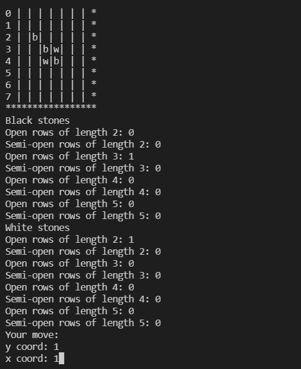

# Gomoku

Gomoku, or Connect 5, is a classic two-player board game played on a board with variable sizes.

This is a simple, minimal-GUI Gomoku program that allows you to play against a computer AI, or your friend. Simply run the `play_gomoku.py` file to start playing now! 

